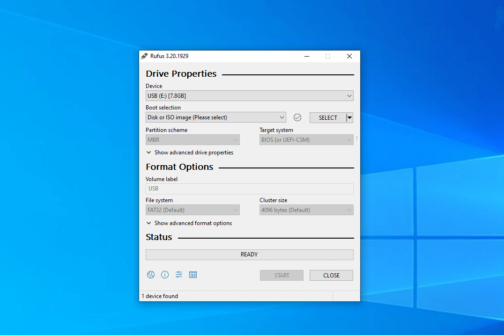

---
## Περίληψη

Αυτός είναι ένας οδηγός για το πώς να εγκαταστήσετε μια διανομή Linux στον υπολογιστή σας. Σε αυτό το άρθρο θα μάθετε πώς να εγκαταστήσετε το Linux Mint σε οποιονδήποτε υπολογιστή, αλλά η διαδικασία είναι περίπου η ίδια για όλες τις διανομές Linux. Το Linux Mint είναι μια διανομή Linux που βασίζεται στο Ubuntu. Χρησιμοποιεί τον διαχειριστή πακέτων apt και γενικά θεωρείται μια από τις καλύτερες διανομές για άτομα που προσπαθούν να ξεφύγουν από τα Windows.

## Λήψη του λειτουργικού

Το πρώτο βήμα είναι να κατεβάσετε το αρχείο iso του Linux Mint. Για να το κάνετε αύτο επισκεφθείτε το https://linuxmint.com/ και επιλέξτε Download. 

Θα ανακατευθυνθείτε στη σελίδα λήψης όπου μπορείτε να δείτε τις 3 κύριες εκδόσεις του Linux Mint: Cinnamon, Mate and Xfce. 

Είναι το ίδιο λειτουργικό σύστημα μόνο με διαφορετικό περιβάλλον επιφάνειας εργασίας (desktop environment). Σε αυτόν τον οδηγό θα επιλέξουμε την έκδοση Cinnamon , οπότε πιέστε Download. 

Μετά από αυτό θα δείτε μια οθόνη με πολλούς συνδέσμους (mirrors) επιλέξτε αυτό που είναι πιο κοντά σε εσάς για ταχύτερη λήψη. Όταν ολοκληρωθεί η λήψη, θα δείτε ένα αρχείο iso στις Λήψεις σας.

## Εγκατάσταση του Linux Mint στο υπολογιστή σας

Ο καλύτερος και ταχύτερος τρόπος για να εγκαταστήσετε και να χρησιμοποιήσετε το Linux Mint και οποιοδήποτε άλλο λειτουργικό σύστημα είναι να το εγκαταστήσετε στον πραγματικό υπολογιστή σας. 

Για να το κάνετε αυτό, πρέπει να διαγράψετε τον σκληρό σας δίσκο, κάτι που δεν είναι ιδανικό για πολλούς ανθρώπους, καθώς θέλουν να διατηρήσουν την εγκατάσταση των Windows στον υπολογιστή τους. Εάν αποφασίσετε να εγκαταστήσετε το Linux σε φυσικό υλικό, θα πρέπει πρώτα να κάνετε ένα αντίγραφο ασφαλείας όλων των αρχείων σας (εικόνες, έγγραφα κλπ.), καθώς αυτή η διαδικασία θα διαγράψει όλα όσα έχετε στον δίσκο σας. 

Εάν δεν θέλετε να εγκαταστήσετε το Linux στο φυσικό σας μηχάνημα και θέλετε απλώς να το δοκιμάσετε, μπορείτε να το πράξετε εγκαθιστώντας το σε μια εικονική μηχανή (virtual machine). Μπορείτε να παραλείψετε τα παρακάτω βήματα και να πάτε κατευθείαν στην [εγκατάσταση σε εικονική μηχανή]()

### Δημιουργεία του USB

Το δεύτερο βήμα είναι να κατεβάσετε μια εφαρμογή για να περάσετε το iso σε ένα USB. Οι 2 κύριες εφαρμογές που χρησιμοποιώ είναι το Balena Etcher και το Rufus. Σε αυτόν τον οδηγό θα χρησιμοποιήσουμε το Rufus. Για να κατεβάσετε το Rufus επισκεφθείτε το https://rufus.ie/ και πατήστε Rufus 3.20. 

Όταν ολοκληρωθεί η λήψη θα εμφανιστεί ένα αρχείο exe στις Λήψεις σας πατήστε πάνω και εγκαταστήστε το.

Όταν ανοίξετε το πρόγραμμα θα δείτε μια οθόνη που μοιάζει με αυτή.

Επιλέξτε το USB που θέλετε να χρησιμοποιήσετε. Αυτή η διαδικασία θα διαγράψει τα πάντα από το USB σας. Πατήστε το Select και επιλέξτε το iso που μόλις κατεβάσατε και πιέστε start. Όταν ολοκληρωθεί η διαδικασία, βεβαιωθείτε ότι έχετε κάνει BACKUP και απενεργοποιήστε τον υπολογιστή σας.

### Επιλογή του USB στο BIOS

Για να κάνετε εκκίνηση από το USB πρέπει να μπείτε στο BIOS του υπολογιστή σας. Το κουμπί του BIOS είναι συνήθως το ESC ή το F2 ή το F12. Εάν δεν είναι κανένα από αυτά για εσάς, ανατρέξτε στο εγχειρίδιό του υπολογιστή σας. Όταν εισέλθετε στο BIOS επιλέξτε το USB σας. Συνεχίστε την [εγκατάσταση του Linux Mint](). 

## Εγκατάσταση σε εικονική μηχανή

Μια εικονική μηχανή (Virtual Machine) είναι ένα εικονικό περιβάλλον που λειτουργεί ως ένας εικονικός υπολογιστής με τον δικό του επεξεργαστή, δικία του μνήμη ram, δικό του δίκτυο, και αποθηκευτικού χώρου, που υπάρχει σε ένα πραγματικό σύστημα. Με απλά λόγια, είναι μια εφαρμογή που τρέχει στον υπολογιστή σας (όπως, για παράδειγμα το Google Chrome) και μιμείται έναν πραγματικό υπολογιστή. 

Αυτό σας δίνει τη δυνατότητα να χρησιμοποιείτε οποιοδήποτε λειτουργικό σύστημα θέλετε χωρίς να χρειάζεται να διαγράψετε τον σκληρό σας δίσκο.Εάν επιλέξετε να εγκαταστήσετε το Linux σε μια εικονική μηχανή, θα πρέπει να κατεβάσετε ένα πρόγραμμα εικονικοποίησης. Τα δυο κύρια προγράμματα που θα πρότεινα για χρήση σε Windows είναι το VMware και το Virtual Box. Σε αυτόν τον οδηγό θα χρησιμοποιήσουμε το Virtual Box. 

Για να κατεβάσετε το Virtual Box επισκεφθείτε το https://www.virtualbox.org/. Πηγαίντε στο κάτω μέρος της οθόνης και πιέστε "Download VirtualBox 7.0" έπειτα πατήστε Windows hosts. Όταν τελειώση η λήψη ένα αρχείο .exe θα εμφανιστεί στις Λήψεις σας. Πατήστε πάνω και εγκαταστήστε το Virtualbox.

### Ρύθμιση του Virtual Box

Το παρακάτω βίντεο σάς δείχνει πώς να ρυθμίσετε την εικονική μηχανή σας για να εγκαταστήσετε το Linux Mint. Μερικά πράγματα που πρέπει να έχετε υπόψη σας: δώστε στην εικονική μηχανή τη μισή μνήμη ram του συστήματός σας και τους μισούς πυρήνες του επεξεργαστή σας.

 

<video width=100% controls>
    <source src="virtualbox.webm" type="video/webm">  
</video>



## Εγκατάσταση του Linux Mint

Το τελευταίο βήμα είναι να εγκαταστήσετε το Linux Mint στο σύστημά σας. Αυτή η διαδικασία θα διαρκέσει περίπου 5-10 λεπτά ανάλογα με την δύναμη του σύστημά σας. Στο παρακάτω βίντεο φαίνεται η διαδικασία η οποία κόπηκε για εξοικονόμηση χρόνου.

 

<video width=100% controls>
    <source src="installation.mp4" type="video/webm">  
</video>


