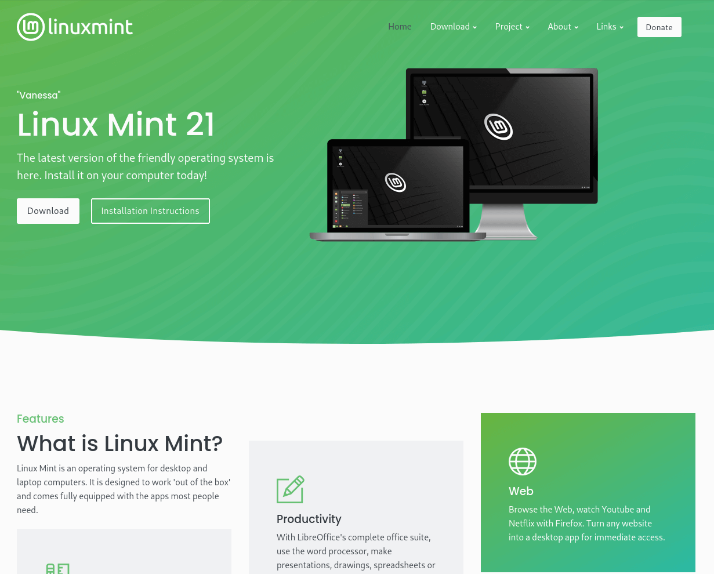

---
## Overview

This is a guide on how to install a Linux distribution on your machine. In this article you will learn how to install Linux Mint on any computer, the process is about the same on all Linux distributions. Linux Mint is a Linux distribution based on Ubuntu. It uses the apt package manager and it's generally considered to be one of the best distributions for people that are trying to get away from Windows.

## Download

The first step is to download the Linux Mint iso. To do that visit  https://linuxmint.com/ and choose Download. 

You will be redirected to the download page where you can see the 3 main Linux Mint editions: Cinnamon, Mate and Xfce. 

These are the same operating system, the only difference is the desktop environment. In this guide we will choose the cinnamon edition, so press on the Download button. 

After that you will see a screen with a lot of mirrors, choose the one that is closest to you for faster download speeds. When the download finishes you will see an iso file on your downloads.

## Installing Linux on real hardware

The best and fastest way to install and use Linux and any other operating system is to install it on physical hardware. 

To do that you have to format your hard drive which is not ideal for many people as they want to keep their Windows install. If you decide to install Linux on physical hardware TAKE A BACKUP of all your files (pictures, documents etc) as this process will delete everything you have. 

If you don't want to install Linux on your physical machine and just want to try it out you can do so by installing it on a Virtual Machine. So skip these steps and go straight to [installing linux on a Virtual Machine]()

### Creating a USB

The second step is to download an app to flash the iso on a USB flash drive. The 2 main apps that I use are Balena Etcher and Rufus. In this guide we will use Rufus. To download Rufus visit https://rufus.ie/ and press on Rufus 3.20. 

When the download finishes a .exe file will appear on your downloads folder click on it and install the app.

When you open it you will see a screen that looks like this.

Select the USB flash drive you want to use. This process will wipe everything on the USB drive. Press on Select and choose the Linux Mint .iso file you downloaded and click start. When the process finishes make sure you have taken a backup of your files and turn off your computer.

### Choosing the USB in BIOS

To boot from the USB you have to boot into the BIOS of your computer. The BIOS key is usually ESC or F2 or F12. If it's none of those for you refer to your manual. When you boot into BIOS choose your USB and boot from it. Continue to [installing Linux Mint](). 

## Installing a Virtual Machine

A virtual machine (VM) is a virtual environment that functions as a virtual computer system with its own CPU, memory, network interface, and storage, created on a physical hardware system. In simple terms it's an app that runs on your computer like, chrome for example that emulates a real computer. 

Which enables you to run any operating system you want without having to wipe your hard drive. If you choose to install Linux on a Virtual Machine you will have to download a virtualization program. The 2 main I would recommend on Windows are VMware and Virtual Box. In this guide we will use Virtual Box. 

To download Virtual Box head into https://www.virtualbox.org/. Head to the bottom of the page and click "Download VirtualBox 7.0" then click on Windows hosts and the downlaod will begin. After the download is finished a .exe file will appear on your downlaods folder. Click it and install VirtualBox.

### Setting up Virtual Box

The video below shows you how to set up your virtual machine to install Linux Mint. Some things to keep in mind: give the virtual machine half of your systems ram and half of your CPU cores.

 

<video width=100% controls>
    <source src="virtualbox.webm" type="video/webm">  
</video>



## Installing Linux Mint

The last part is to install Linux Mint on your system. This process will take about 5-10 minutes depending on your hardware. The video below shows the process and it was cut for the sake of time.

 

<video width=100% controls>
    <source src="installation.mp4" type="video/webm">  
</video>


